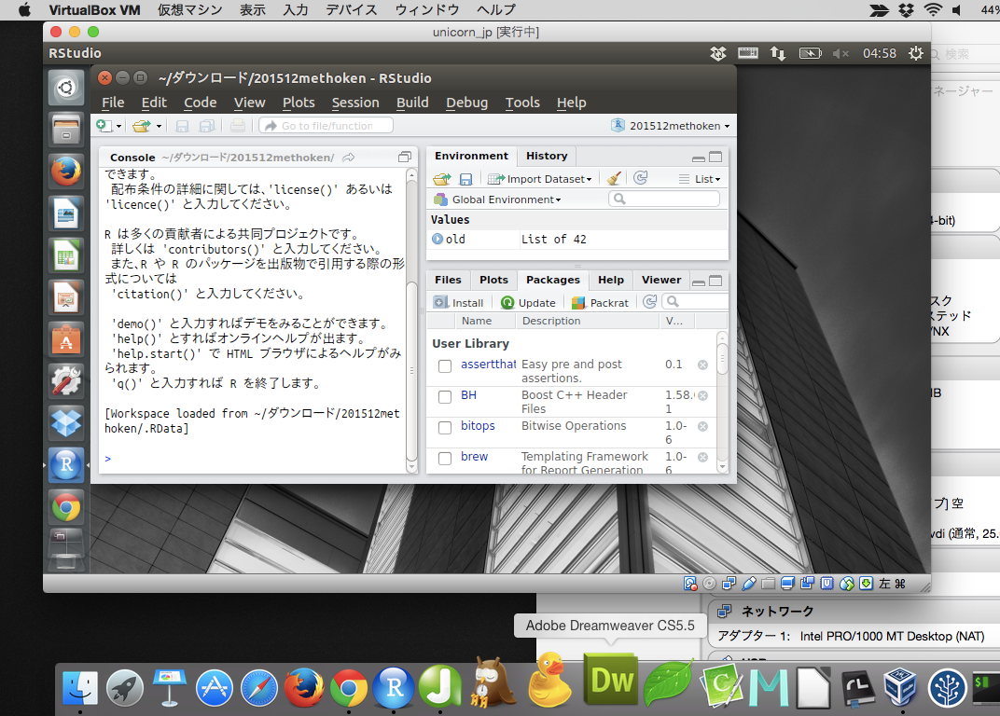
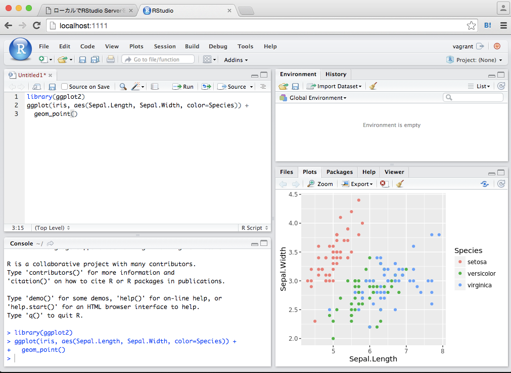
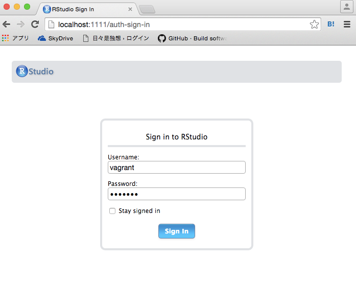

```{r setup, include=FALSE}
knitr::opts_chunk$set(echo = FALSE)
library(DiagrammeR)
library(magrittr)
```

# 自己紹介

## 所属など
<div class="column1">
- 比治山大学短期大学部
- @kazutan
    - Twitter
    - GitHub
    - Qiita
- http://kz-md.net/
- http://blog.kz-md.net/
</div>
<div class="column2">

</div>

# 今回の内容

## 目指すもの
- WinやMac、Linuxなど**プラットフォームに依存しない**RStudio環境の構築
- すぐに廃棄できて、すぐに構築できるようにする
- 作った環境をみんなに共有できるようにする

## 実行します
- デモをします
    - 今日説明する下準備を終えてます
    - Terminalから所定のディレクトリで以下のコマンドを実行
    ```
    $ vagrant up
    ```
- しばらく時間かかるので、話を進めます

# 前振り

## Rはクロスプラットフォーム?
- 「Rはクロスプラットフォームだ」とよく言われる
    - 確かにWindows, Mac ,主要Linuxディストリビューションで対応
    - ほとんどのパッケージがそれぞれで利用可能
- そしてRStudioも各種プラットフォームに対応
    - Windows, Mac, 主要Linuxディストリに対応
    - 各種機能も十分に機能

Rは「クロスプラットフォーム」ですね。

## プラットフォーム間での悩み
でも実際使ってるといろいろ悩みが発生する
```{r echo=FALSE}
nayami <- data.frame(
  plat=c("Windows", "Mac", "Ubuntu", "その他共通"),
  comment=c("文字コードの闇、C++コンパイラ、Gitまわり、等",
            "XCodeでかい、ショートカット、homebrew前提な記事多い、等",
            "RStudioの日本語入力問題、等",
            "ファイルパス、環境変数、等")
)
knitr::kable(nayami,col.names = c("","悩みなど"))
```

ひとりで使う分にはそこまで気にならないが、それでも…

## 仮想環境のススメ
```{r}
create_graph(
  nodes_df = create_nodes(1:3,
                          label = c("プラットフォームが違うから困る",
                                    "プラットフォームが共通なら困らない",
                                    "だったら仮想マシン上でR使えばいい!"),
                          color = "Blue1", fillcolor = "White:Aqua",
                          fontcolor = "Blue4",
                          shape = "polygon",
                          width = "4", fixedsize = TRUE,
                          style = "rounded,radial"),
  edges_df = create_edges(from = 1:2,
                          to = 2:3)
) %>% render_graph
```

## 仮想環境を準備すれば…
<div class="column1">
- あたかもコンピュータ内にさらにコンピュータが存在するような感じ
- これを準備すれば、どんなプラットフォームでも共通した環境が準備できる!
</div>
<div class="column2">

</div>

## メリット
- 作業環境をほとんど共通化できる
    - 仮想マシンのOSを揃えればOK
- ホストマシンと切り離せる
    - 多少無茶しても作り直せる
    - 色々テストしてみても構わない

## 仮想マシンを作るには
1. 仮想環境用のソフトウェアをインストール
    - VirtualBoxやVMware、Parallelなど
2. 各種ソフトウェアで仮想マシンを作る
    - CPU数、メモリ、記憶領域、ネットワーク設定など
3. 仮想マシンにOSをインストール
    - 準備してください
4. 仮想マシンの初期設定、作業環境準備
    - 要するに新しいマシンをセットアップ

## もっと楽にしてくれ!
- 新しいマシンを準備するということには変わりない
    - 一からセットアップしていく必要
- 仮想マシンのOSはオープンなものを利用
    - 使ってない人にはその使い方から学習する必要
- やることが多くて面倒
    - もっとこう、シンプルな手段を…

## RStudio Serverという提案
- RStudioのサーバーアプリケーション版
    - サーバーにRとRStudioをインストール
    - **ブラウザでアクセスし、ブラウザで実行**
    - デスクトップ版と**機能的に遜色なし**
    - **プラットフォームに依存しない!!**
- 別途Linuxサーバーが必要
    - 自前でサーバーをこしらえるのは大変…
    - でもWebブラウザでアクセスできるならどこでもOK
    - つまり、**ローカルの仮想マシンでもOK!!**

## どうすればいい?
つまり、こういうことです。

- 仮想環境としてLinuxのサーバーをローカルに構築
- その仮想マシンにRとRStudio Serverをインストール
- Webブラウザからアクセスして使う

## 実現すると…?
こうなります。



# 実装編

## 手順
1. Terminal環境の準備(主にWin)
2. 仮想化に必要なソフトウェアのインストール
    - VirtualBox, Vagrant
3. 仮想マシンの作成
    - boxイメージの取得
    - 仮想マシンの作成と起動・ログイン
4. 仮想マシンにRとRStudioServerのインストール
5. ブラウザでログインして動作確認

詳細は、こちらのQiita記事にまとめました:  
[Vagrantでローカルの仮想マシンにRStudioServer環境を作る - Qiita](http://qiita.com/kazutan/items/6048fa8d46683dcad788)

## 1. Terminal環境の準備
- Windows8.1の場合
    - さっきの記事に書いたのでそちらを参照してください
    - MSYS2をインストール&設定
- Macの場合
    - 標準でTerminalがはいってるので、それでOKです
    - 私はiTerm2を使ってます

## 2. 仮想化に必要なソフトウェアのインストール
- VirtualBox
    - 仮想環境を準備してくれるソフトウェア
    - 以下より各プラットフォーム向けの最新版をDLして入れてください  
    https://www.virtualbox.org/
- Vagrant
    - 仮想環境を簡単に構築できるようにするソフトウェア
    - 以下より各プラットフォーム向けの最新版をDLして入れてください  
    https://www.vagrantup.com/

## 3. 仮想マシンの作成
### 3.1 ボックスファイルのDLと追加(Win, Mac)
- 仮想マシンのベースになるファイル
    - OSや各種基本的な設定が完了しているもの
    - まあ要するに「工場出荷状態」のイメージみたいなもの
- 今回はUbuntu公式の14.04をもってきてみます  
```
$ vagrant box add ubuntu1404 https://cloud-images.ubuntu.com/vagrant/trusty/current/trusty-server-cloudimg-amd64-vagrant-disk1.box
```
    - `vagrant box add ubuntu1404`の`ubuntu1404`は、このボックスの名称です。あとで使います。
    - マシンのベースになるものなので、数百MBにもなります
    - この後にも色々DLしてくるので、通信制限のない安定した回線下で作業することをオススメします

---

### 3.2 仮想マシンの準備(Win)
以下、Terminalで実行しています

1. 適当な場所にVagrant用のディレクトリ(フォルダ)を作成
    - 今回はユーザーのホームディレクトリ下に準備
```
$ mkdir -p /c/Users/(ユーザー名)/Vagrant/ubuntu1404
```
2. 作成したディレクトリへ移動
```
$ cd /c/Users/(ユーザー名)/Vagrant/ubuntu1404/
```
3. 仮想マシンの初期化
```
$ vagrant init ubuntu1404
```
    - `vagrant init`で初期化、`ubuntu1404`はボックス名
    - これでこのディレクトリに`Vagrantfile`が作成

---

### 3.3 仮想マシンの準備(Mac)
ディレクトリへの**パスの書き方が変わるだけであとは共通**です

```
$ mkdir -p ~/Vagrant/ubuntu1404
$ cd ~/Vagrant/ubuntu1404/
$ vagrant init ubuntu1404
```

---

### 3.4 仮想マシンの作成
さあ、準備したディレクトリで以下のコマンドを実行しましょう

```
$ vagrant up
```

これで一気にubuntu14.04サーバーがローカルに構築!

---

### 3.5 仮想マシンへのログイン(ssh)
- まだ作っただけなので、操作をするためにsshログイン
    - 先ほどのディレクトリで以下のコマンドを実行
```
$ vagrant ssh
```
    - 今回はネットワーク設定を変更していないのでこれでいけます
    - もし通常のsshでログインするなら、IPまわりの設定を確認してください
        - いじってなければこれでいけるはず
```
$ ssh -p 2222 vagrant@127.0.0.1
```

## 4. RとRStudioServerを導入
### 4.1 Rのインストール
- 要するにUbuntuにRをインストールする方法と同一
    - そのままインストールするとちょっと古いのが入る
    - Rの最新版を入れる手順でやります
- `vagrant ssh`で仮想マシンにログインして以下を実行
    - `gpg`は、Webによく転がっている方法と**プロコトルが違います**
```
$ echo "deb https://cran.rstudio.com/bin/linux/ubuntu trusty/" | \
  sudo tee -a /etc/apt/sources.list.d/cran.list
```
```
$ gpg --keyserver hkp://keyserver.ubuntu.com:80 --recv-keys E084DAB9
$ gpg -a --export E084DAB9 | sudo apt-key add -
```
```
$ sudo apt-get update
$ sudo apt-get upgrade
$ sudo apt-get install r-base-dev
```

---

### 4.2 RStudoServerのインストール
最新の安定版(0.99.879)を入れます。[公式の手順](https://www.rstudio.com/products/rstudio/download-server/)とは少し違いますが大丈夫です。

```
wget https://s3.amazonaws.com/rstudio-dailybuilds/rstudio-server-0.99.876-amd64.deb
sudo dpkg -i *.deb
sudo apt-get -f install rstudio-server
```

---

### 4.3 仮想マシンの設定を変更して再起動
- ポートフォワーディングの設定が必要
    - まずは仮想マシンからでます
```
(仮想側)$ exit
```
    - Vagrantfileを開く
    - `forwarded_port`設定を書き換える
```
config.vm.network "forwarded_port", guest: 8787, host: 1111
```
    - コメントアウト(行頭に`#`)が入ってます。`host`の番号は任意。
- 編集したら仮想マシンを再起動
```
(ホスト側)$ vagrant reload
```

## 5.ブラウザでアクセス
<div class="column1">
- ブラウザを起動
- 以下のURLにアクセス
```
http://localhost:1111
```
- id,passともに`vagrant`
</div>
<div class="column2">

</div>

---

Yeah!!


# 冪等性の確保と簡略化へ

## どこが「簡単」なんだよ!!!

## よろしい、ならばVagrantfileだ
`vagrant up`をする前に、`Vagrantfile`に必要事項を編集しておけば、仮想マシンを建てたあとに自動的に色々実行できます

- 最初はとっつきにくいかも
- でも**自動的に処理ができる**
- つまり、**何度やっても誰がやっても同じ環境を作れる**
- **このファイルさえ共有すればすべてOK**

## 今回の内容をまとめたもの

```
Vagrant.configure(2) do |config|

# 通常はこちらを使って下さい
# config.vm.box = "ubuntu/trusty64"

# この記事の上の方で登録したboxを利用するため"ubuntu1404"としています
  config.vm.box = "ubuntu1404"

# 共有ディレクトリ設定(コメントアウトしてます)
 # config.vm.synced_folder "../data", "/vagrant_data"

# ポートフォワーディング設定
  config.vm.network "forwarded_port", guest: 8787, host: 1111

#仮想マシンのメモリ設定
  config.vm.provider "virtualbox" do |vb|
    vb.memory = "2048"
  end

# 以下プロビジョニング用スクリプト
$script = <<SCRIPT
echo "deb https://cran.rstudio.com/bin/linux/ubuntu trusty/" > /etc/apt/sources.list.d/cran.list
sudo apt-key adv --keyserver hkp://keyserver.ubuntu.com:80 --recv-keys E084DAB9
sudo apt-get update
sudo apt-get install -y r-base r-base-dev

## for install devtools, rvest(libxml2)
# sudo apt-get install -y libcurl4-openssl-dev libssl-dev libxml2-dev

## r-packages install
# sudo R -e "install.packages('devtools', repos = 'https://cran.rstudio.com/', dep = TRUE)"
# sudo R -e "install.packages('ggplot2', repos = 'https://cran.rstudio.com/', dep = TRUE)"
# sudo R -e "install.packages('dplyr', repos = 'https://cran.rstudio.com/', dep = TRUE)"
# sudo R -e "install.packages('tidyr', repos = 'https://cran.rstudio.com/', dep = TRUE)"
# sudo R -e "install.packages('stringr', repos = 'https://cran.rstudio.com/', dep = TRUE)"
# sudo R -e "install.packages('rvest', repos = 'https://cran.rstudio.com/', dep = TRUE)"
# sudo R -e "install.packages('rmarkdown', repos = 'https://cran.rstudio.com/', dep = TRUE)"
## rstudio-server install
wget https://s3.amazonaws.com/rstudio-dailybuilds/rstudio-server-0.99.876-amd64.deb
sudo dpkg -i *.deb
sudo apt-get -f install rstudio-server
rm *.deb
SCRIPT

# スクリプト実行
  config.vm.provision "shell", inline: $script

end
```

コメントアウトしてますが、Rのパッケージをインストールする内容も書いてます。  
これを`Vagrantfile`として保存して`vagrant up`すればOK

## 注意事項
- 私の手元では無事に走りました…が、うまくいかないときはご連絡ください
- `vagrant up`すると相当ながいことターミナルに出力が吐き出されます(特にシェルスクリプト部分)。実際に利用するとなったら、エラーのみ標準出力させるよう修正したほうがいいです。
- 共有ディレクトリ設定`# config.vm.synced_folder "../data", "/vagrant_data"`は自分が管理しやすいところにしておいた方がいいでしょう。OSによってパスの書き方が変わるので注意してググってください。

# まとめ

## ローカルにRStudioServerを準備するには
0. Terminal環境を準備
1. VirtualBoxとVagrantをインストール
2. 適当なディレクトリを準備
3. Vagrantfileを作成(コピペ)
4. そのディレクトリで`$ vagrant up`を実行
5. ブラウザでアクセスしてログイン

これでOK!

## Enjoy!

参考資料:

- [Vagrantでローカルの仮想マシンにRStudioServer環境を作る - Qiita](http://qiita.com/kazutan/items/6048fa8d46683dcad788)